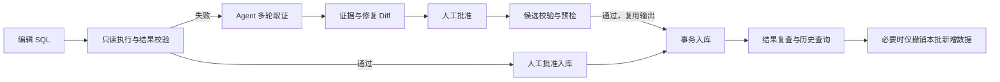
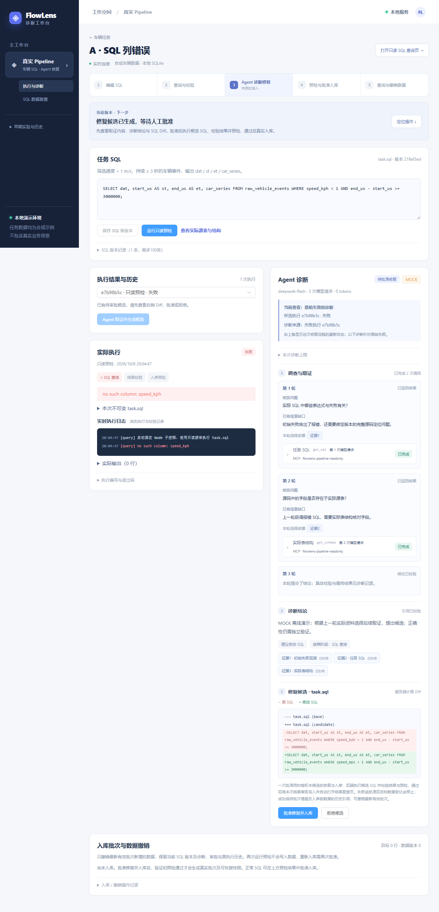
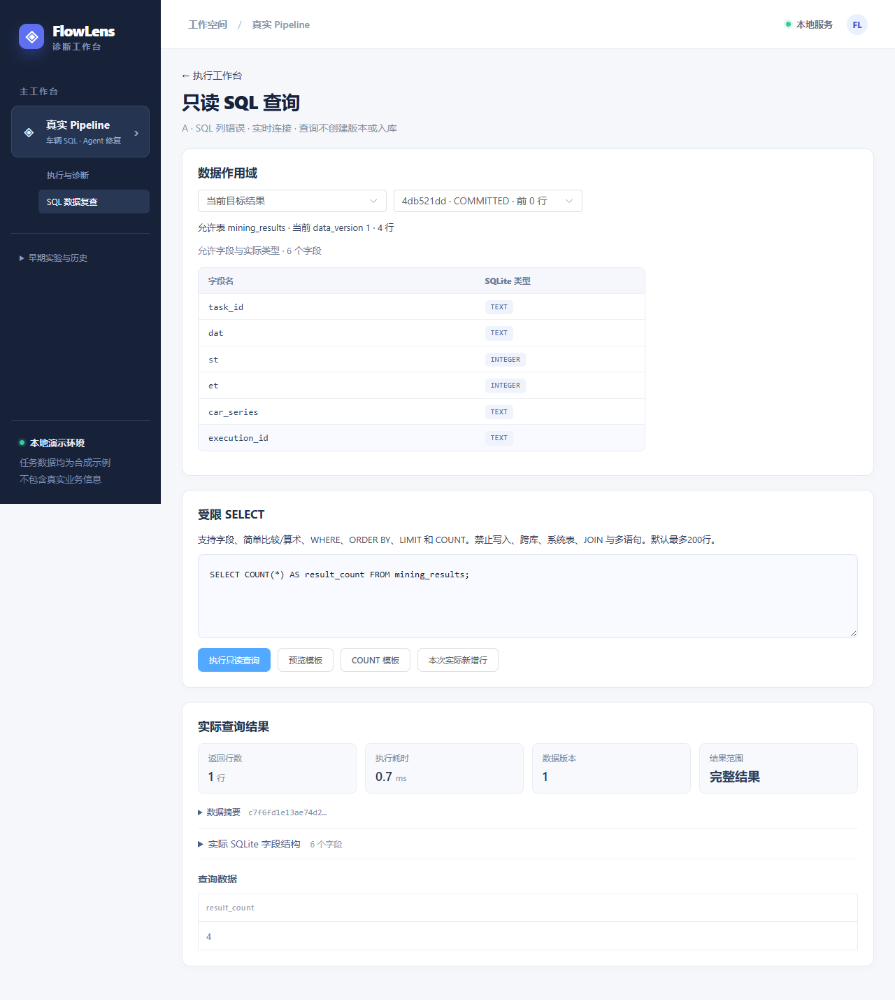
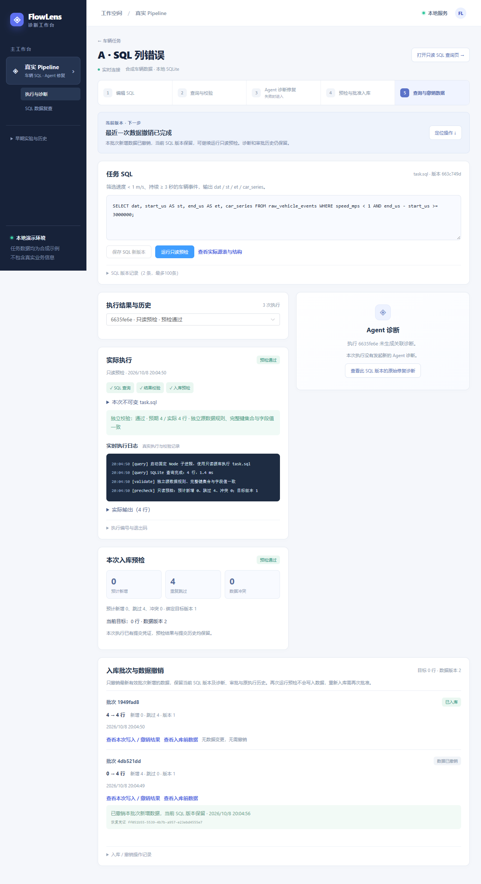

# FlowLens · 数据任务智能诊断工作台

受实习期间数据任务排障场景启发，基于合成车辆数据构建本地 SQL 执行与 Agent 诊断工作台，支持查询校验、故障取证及 SQL 修复，提供人工审批、事务入库、批次数据撤销与执行历史回溯能力。

**Vue 3 / TypeScript · SSE 实时状态 · MCP 多轮取证 · 人工审批修复 · 增量数据撤销**

[快速体验](#快速体验) · [界面预览](#界面预览) · [五分钟演示](docs/pipeline-demo-script.md) · [架构设计](docs/architecture.md) · [工程问题与面试素材](docs/engineering-cases.md)

## 项目解决什么问题

数据任务排障通常需要在 SQL、表结构、执行日志和结果之间反复核对，修复后还要确认结果是否符合业务规则、写入是否重复、错误数据能否撤销。FlowLens 将这些步骤放在同一个工作台：Agent 依据实际工具返回提出修复候选，用户查看证据和 Diff 后批准，平台执行校验并提交数据。

主入口为 `/pipeline`。SQL 在本地 SQLite 中真实执行，车辆输入为自行生成的合成数据，模型来源在界面明确标识为 **MOCK / LIVE**。

## 核心能力

| 能力               | 实现                                                                                                               |
| ------------------ | ------------------------------------------------------------------------------------------------------------------ |
| 执行与诊断工作台   | SQL 编辑、只读查询、执行日志、诊断证据与 Diff 关联展示；保留版本和执行历史。                                       |
| 实时状态与恢复     | SSE 持久事件与游标续传、去重和状态核对；切换项目时处理取消与迟到响应。                                             |
| Agent 多轮取证     | LLM API 对接 MCP 工具服务，根据实际返回继续取证；校验参数、来源与引用，重复观测反馈和预算限制约束异常循环。        |
| 审批修复与入库     | 人工批准当前候选，SQL 单次执行，经独立结果校验与只读预检后复用输出事务入库；版本绑定和幂等凭证防止失效或重复提交。 |
| 增量历史与数据撤销 | 一次基线加增量事件保存可重建历史；仅撤销最新有效批次的实际新增行，保留原有数据、当前 SQL 版本及诊断审批历史。      |

## 操作流程



MCP 工具负责只读取证，LLM 生成 SQL 候选；批准后的校验、版本发布、入库与撤销由平台后端执行。撤销数据后，修复后的 SQL 仍保留，再次预检通过也不会自动入库。

## 界面预览

以下截图来自 2026-10-08 的隔离数据库浏览器回归：使用 MOCK 网关、真实 SQLite 执行及 MCP stdio 服务。点击展开查看完整页面。

<details>
<summary><strong>诊断与修复候选</strong>：实际错误、多轮工具返回、证据引用与 SQL Diff</summary>



</details>

<details>
<summary><strong>只读数据查询</strong>：核对目标库字段与实际入库行数</summary>



</details>

<details>
<summary><strong>数据撤销与历史</strong>：保留修复后的 SQL，撤销批次新增数据后再次只读预检</summary>



</details>

[历史 LIVE 浏览器录屏（2026-10-07）](docs/demos/pipeline-live-browser-20261007.webm)保留了当时的实际模型调用与操作。该录屏早于本轮 MCP 和增量历史改造；当前流程以本页和[演示稿](docs/pipeline-demo-script.md)为准。

## 快速体验

验证环境：**Windows · Node.js 24.14.1 · pnpm 11.5.0 · Chrome**。安装对应运行环境后，在 PowerShell 中执行：

```powershell
git clone https://github.com/Leslie0957/FlowLens.git
cd FlowLens
pnpm install --frozen-lockfile
pnpm build
$env:MODEL_MODE = 'MOCK'
pnpm demo:pipeline
```

打开 <http://127.0.0.1:5180/pipeline>，按[五分钟演示稿](docs/pipeline-demo-script.md)体验：

| 场景               | 初始问题                                                 | 展示重点                                                     |
| ------------------ | -------------------------------------------------------- | ------------------------------------------------------------ |
| A · SQL 列错误     | `speed_kph` 不存在，SQLite 查询实际失败                  | 取证 → SQL Diff → 人工批准 → 校验与入库。                    |
| B · 输出契约错误   | 查询成功，但别名 `vehicle_type` 不符合 `car_series` 要求 | SQL 执行成功仍可能不满足业务结果，Agent 需要核对输出和规则。 |
| C · 正常与幂等重跑 | 正常预检后批准入库，再次入库跳过重复业务键               | 新增 / 跳过计数、历史查询与数据撤销。                        |

演示命令使用独立的 `data/pipeline-demo/` 数据库，首次准备 A/B 真实失败现场，重启保留演示历史；Ctrl+C 停止演示服务。MOCK 无需密钥，启动时会自动迁移并初始化演示数据。详情见[运行与配置](docs/operations.md)，开发启动可使用 `pnpm dev`。

## 技术栈与代码入口

| 层           | 技术与入口                                                                                                                                                    |
| ------------ | ------------------------------------------------------------------------------------------------------------------------------------------------------------- |
| 前端         | Vue 3、TypeScript、Vite、Pinia、Element Plus；[页面与组件](apps/web/src)、[SSE 状态客户端](apps/web/src/pipeline-client.ts)。                                 |
| 后端         | Node.js、Express、SQLite；[HTTP 接口](apps/server/src/pipeline-http.ts)、[任务执行与审批入库](apps/server/src/pipeline.ts)。                                  |
| Agent 与工具 | LLM API、MCP 官方 TypeScript SDK / stdio；[诊断循环](apps/server/src/pipeline-agent.ts)、[工具服务](apps/server/src/pipeline-mcp-server.ts)。                 |
| 契约与历史   | Zod 共享契约；[协议定义](packages/contracts/src/pipeline.ts)、[数据事务](apps/server/src/pipeline-data.ts)、[增量历史](apps/server/src/pipeline-history.ts)。 |
| 验证         | Vitest 单元 / 集成测试、Playwright 浏览器端到端测试、结构化日志、Prettier；pnpm workspace 管理前后端与共享包。                                                |

## 验证结果

截至 **2026-10-08**，业务与测试代码提交 `9d75d33` 的[完整远端检查](https://github.com/Leslie0957/FlowLens/actions/runs/37777370529)已通过：

| 检查                   | 结果                                                                          |
| ---------------------- | ----------------------------------------------------------------------------- |
| 服务端 Vitest          | 169 项通过，包含真实 MCP 通信、分页取证、引用校验、审批、增量历史与事务异常。 |
| 前端 Vitest            | 48 项通过，覆盖诊断展示、事件恢复、状态与异步交互。                           |
| Playwright             | 45 项通过，使用独立测试数据库和 MOCK 模型。                                   |
| 格式、类型、lint、构建 | 全部通过。                                                                    |
| P0 / M5 离线评测       | 6 问 / 12 问机械检查通过；语义措辞仍需人工复核。                              |

本地可复现的检查命令：

```powershell
pnpm exec playwright install chrome ffmpeg
pnpm format:check
pnpm typecheck
pnpm lint
pnpm test
pnpm build
pnpm test:e2e
pnpm check:pipeline:start
pnpm eval:mock
pnpm eval:mock --m5
```

自动化检查使用 MOCK 或受控网关，不产生模型费用。真实 MCP 通信测试验证的是工具调用链，不能据此推断真实模型的诊断准确率。[四项改造验收](docs/pipeline-maintenance-acceptance.md)和[重复取证纠错记录](docs/pipeline-observation-fix-acceptance.md)保留实际报告、失败样本与修复依据。

## 设计范围

- 本项目为本地单用户演示，使用合成车辆数据；未连接公司数据库或生产任务系统。
- 当前业务仅追加数据；支持最新有效批次撤销，不提供任意历史批次或通用 UPDATE / DELETE 撤销。
- SSE 同步任务与工具事件；诊断正文在校验后逐步展示，当前车辆链路未实现模型 token 实时推送。
- 增量历史减少逐批整表快照存储和撤销写入量；提交 / 撤销仍有整表 hash 核对和历史重建成本。
- 早期模拟任务与订单实验保留在侧栏“早期实验与历史”；其阶段结果在[文档索引](docs/README.md)中单独列出。

## 进一步了解

- [五分钟演示](docs/pipeline-demo-script.md) · [架构设计](docs/architecture.md) · [运行与配置](docs/operations.md) · [HTTP / SSE 契约](docs/api-events.md)
- [工程问题与面试素材](docs/engineering-cases.md) · [文档索引](docs/README.md) · [已完成待办](docs/todo.md)
- [来源与许可说明](third_party/mini-claude/NOTICE.md)：miniClaude 教程项目仅作为架构参考；FlowLens 的 Agent Loop 与产品代码自行实现，上游 MIT 许可不代表本项目整体采用 MIT 许可。
