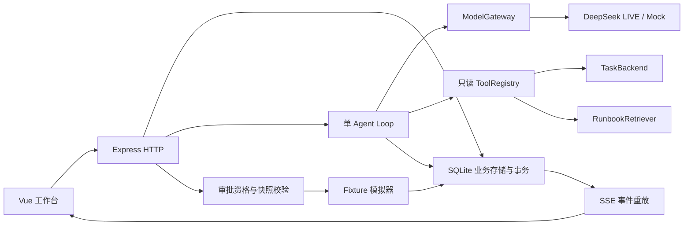

# P0 当前架构

2026-10-01，M4 实现版本。M1/M2 文档保留各阶段历史，本文件描述当前代码。

## 层与事实来源

| 层 | 入口 | 当前责任 |
|---|---|---|
| 页面 | apps/web/src/pages | 运行列表、日志、会话、诊断和按钮审批；模型来源与数据来源分别标识。 |
| 协议 | packages/contracts/src/index.ts | HTTP DTO、轮次/证据/审批、事件 envelope、诊断结果的 Zod 契约。 |
| HTTP | apps/server/src/http.ts | 参数校验、错误和 request_id、幂等 API、快照、SSE；消息返回 202 后启动 Agent。 |
| Agent | diagnosis-agent.ts、diagnosis-context.ts | 有界多轮上下文、工具循环、流式落库、一次格式/语义修复、超时/取消。 |
| 适配 | model-gateway.ts、diagnosis-tools.ts、tool-registry.ts | 模型与数据/检索替换点；可信代码注册，禁止模型或 HTTP 注册任意执行能力。 |
| 持久化 | db.ts、diagnosis-store.ts、store.ts | SQLite schema v4、幂等、状态/消息/事件/证据/审批、模拟进度。当前用例直接使用 SQLite，不宣称有完整通用 Repository 层。 |

SQLite 是事实来源；前端流式文本只是预览，结构化结果必须经服务端校验。事件 seq 按会话递增，快照事务读取 last_event_seq，随后订阅 after_seq。前端以 session_id、seq 去重，以 generation、AbortController 和 evidenceTicket 阻止旧请求覆盖新会话。重试失败的模型流使用 message.reset 清除该次未验证片段。

## Agent 与权限

默认四个只读工具：get_task_run、get_task_definition、get_task_logs、search_runbook。运行状态由服务端预读；其余查询由模型选择。工具限制绑定 run/task、严格参数与 20KB 返回体。Runbook 是四篇自建文档的关键词检索，最多返回三段；不是向量 RAG。

当前 Prompt m4-2。模型使用 JSON Output，但仍执行 Zod 和语义校验：NONE 仅允许成功运行；UNKNOWN 必须 NEEDS_CONFIRMATION；已知失败原因至少引用已注册 LOG；所有引用属于当前会话，重试建议必须绑定当前合资格运行。LOG 类型门槛不自动证明模型解释正确，内容准确性仍由独立评测检查。

每轮最多 12 次模型请求、8 次动态工具调用、120 秒；模型请求 45 秒，工具 5 秒；暂时性请求失败最多重试一次，输出修复最多一次。LIVE 不静默回退 Mock。本机持续 LIVE 授权与 2048 输出上限保留；有限请求计数只在进程内，不能充当跨重启费用账本。

审批由独立确定性用例执行：校验当前资格、诊断建议、10 分钟有效期、运行快照；SQLite 事务和唯一约束保证 parent 的 child 与 action_execution 不重复。聊天文字不能批准或执行。场景模拟器每 250ms 从持久化事件索引推进，重启恢复模拟进度。原失败运行不被改写。

## 恢复与可观测性

持久化 run/log、session/turn/message、tool_call、evidence/result、agent_event、approval/execution 和 simulation_state。浏览器断流恢复的是已保存事件；服务重启将活动诊断置 INTERRUPTED，并允许新 turn。**没有 Agent 的 plan、working_memory 或执行 checkpoint，不能从模型循环中断点 Continue；本阶段按用户要求暂缓。**

日志白名单保存 request/run/session/turn/tool/event ID、错误、Prompt 版本、模型请求序号、耗时和 usage；不输出 Key、完整问题/Prompt/工具正文。model.first_delta 计的是请求开始到第一个内容或工具 delta；页面提交反馈与整轮耗时分开记录。评测的实际回答仅来自独立 fixture 会话，另存评测产物。

工具成功的有界 output 保存于已有 result_summary_json，并随 tool.completed 输出；无需数据库迁移。ToolTraceCard 通用展示调用 ID、用途、开始时间、终态耗时、参数和查询结果，结果以文本渲染、不执行 HTML。旧记录/事件没有完整 output 时继续展示已有摘要；不会伪造历史完整结果。

任务与日志都是 FIXTURE，成功重试是模拟恢复。当前验证为 Windows 本地单用户、小样本、Chrome；不含生产负载、公网鉴权、真实任务连接或跨浏览器验收。
