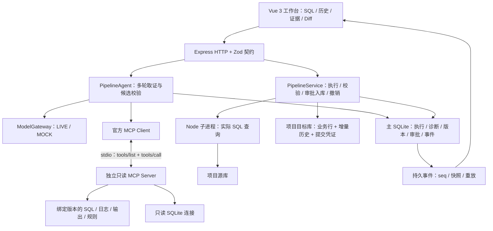

# FlowLens 当前架构

更新日期：2026-10-08。本文描述当前车辆 Pipeline 主链路；[早期 P0 / M6 架构](architecture-p0-m6.md)保留阶段历史。产品概览见[首页](../README.md)，接口见[HTTP / SSE 契约](api-events.md)。

## 模块与数据流

## 代码职责

| 模块       | 当前入口                                                                                           | 职责                                                                |
| ---------- | -------------------------------------------------------------------------------------------------- | ------------------------------------------------------------------- |
| 页面与状态 | `apps/web/src/pages/`、`pipeline-client.ts`                                                        | SQL 编辑、执行历史、证据与 Diff；状态快照、SSE 恢复和迟到响应防护。 |
| HTTP       | `apps/server/src/pipeline-http.ts`                                                                 | 严格参数、幂等键、项目归属检查，调用平台用例并返回契约结果。        |
| 共享契约   | `packages/contracts/src/pipeline.ts`                                                               | 执行、诊断、候选、证据、事件、批次与查询结果的 Zod schema。         |
| 诊断循环   | `apps/server/src/pipeline-agent.ts`                                                                | 模型请求、真实工具回写、进展识别、引用检查、候选与审批状态。        |
| MCP        | `pipeline-mcp-client.ts`、`pipeline-mcp-server.ts`、`pipeline-tools.ts`、`pipeline-tool-reader.ts` | 工具发现、调用、统一定义、只读连接、来源与响应校验、进程清理。      |
| 执行与数据 | `pipeline.ts`、`pipeline-runner.mjs`、`pipeline-sql.mjs`、`pipeline-data.ts`                       | 真实只读查询、独立结果校验、预检、事务入库、凭证核对与撤销。        |
| 历史       | `pipeline-history.ts`、`pipeline-logs.ts`                                                          | 基线和增量重建、历史完整性检查、稳定日志序号与分页。                |

前后端和共享契约由 pnpm workspace 管理。主应用库保存流程事实，各项目使用独立源库和目标库；固定合成车辆规则的期望结果由确定性代码独立验证，不由模型判定成功。

## Agent 取证与权限

模型根据初始实际失败与上一轮工具返回自主选择下一项工具。当前 MCP 提供执行、SQL、表结构、日志、输出预览和任务契约六类只读工具；实际 `tools/list` 发现的定义适配为原生 Tool Calling，实际 `tools/call` 返回通过校验后按原 call ID 回写上下文并登记证据。

可信后端绑定项目、执行、SQL / 输入 / 日志版本和内容 hash，模型参数不能切换读取范围。客户端和服务端共同拒绝过期或跨范围来源；服务使用只读 SQLite，不负责迁移、入库或撤销。每个诊断使用独立 stdio 服务，开发入口与构建后的 JS 入口均已验证；连接失败明确停止，取消 / 超时 / 退出时清理子进程。

首份工具观测前只允许一次单项读取；首轮批量调用明确暂缓，不执行、不生成证据。收到结果后可同轮读取独立信息，没有固定六工具必读清单。日志使用原始稳定 seq 分页，支持条数、阶段和级别筛选；完整工具响应最多 20 KiB，单条日志无法完整容纳则返回错误。

重复观测按实际内容识别，原证据 ID 和剩余无进展预算回写模型；新 UUID、重复页或仅改变读取参数不制造进展。最终回复使用严格 JSON / Zod、失败阶段、来源与候选 hash 校验，最多独立纠错一次；总请求、时间和上下文预算持续生效。[预算配置](operations.md#live-模型)与[真实失败及纠错依据](pipeline-observation-fix-acceptance.md)可查。

## 审批、执行与入库

1. 模型生成完整 `task.sql` 候选，平台核对基础 hash、允许路径与证据，计算 Diff，进入等待审批。
2. 用户批准当前候选；组合批准额外记录目标数据版本 / 摘要和校验通过后的入库范围。
3. 平台将候选以 `CANDIDATE_CHECK` 类型只读执行一次，经独立结果校验和入库预检通过后发布 SQL 版本。
4. 若批准包含入库，复用本次执行输出；再次核对绑定与有效期后，在目标短事务中写业务行、增量记录、历史元数据、批次、凭证及数据版本。
5. 失败显式回滚，取消、目标变化或失效批准停止写入。重启依据真实提交凭证对账，没有凭证的中断写入不自动重放。

当前流程不创建独立验证目标库或试入库后重跑。正常 SQL 也可在只读预检后单独批准入库；旧仅验证审批保持原权限。聊天文本、工具返回或前端状态不能代替批准。

## 基线、增量历史与撤销

项目目标库独立迁移至 schema v2；启动 / 可写入口执行幂等迁移，只读连接不迁移。旧完整快照保留；旧库第一次进入增量模式时用当前业务行建立一次可信基线。

新历史由一次完整基线、单调 `INSERT / UNDO_INSERT` 事件链和每批常量大小的快照元数据组成。入库前历史可重放重建，并核对链、行数和 hash；当前整表 hash 读取及历史重放成本仍存在。

仅最新有效且实际新增的批次可撤销。短事务核对版本、摘要、历史与行归属后，精确删除该批实际新增行，更新撤销事件、凭证、版本和前一有效头。零新增批次不推进有效头；失败完整回滚。撤销保留当前 SQL、原有行、诊断与审批历史，不清空业务表后重插。

## SSE、状态恢复与可观测性

主库持久化事件，项目内 seq 单调递增；客户端先应用同读事务快照，再从成功应用的游标订阅事件。重连、去重与定期只读状态核对共同处理断流 / 漏收，快照失败不推进游标。

项目切换与卸载清理连接和请求，generation、取消信号与请求序号防止迟到结果覆盖新项目。浏览器 sessionStorage 保存响应不确定的幂等键，后端唯一凭证决定是否真实执行过。

SSE 同步真实任务与工具事件。车辆诊断正文在服务端完成校验后由前端逐步呈现；当前没有模型 token 实时 SSE 推送，也没有 Agent checkpoint / Continue。结构化日志关联请求、诊断和工具，但不输出密钥、完整 Prompt 或工具正文。

## 验证与范围

[完整远端验证](https://github.com/Leslie0957/FlowLens/actions/runs/37777370529)对应业务代码 `9d75d33`：169 服务端、48 前端、45 MOCK 浏览器测试及构建 / 离线评测通过。真实 MCP 通信、事务失败、重启凭证和历史损坏等都有自动化回归，详见[改造验收](pipeline-maintenance-acceptance.md)。

当前验证范围为 Windows 本地单用户、合成数据、Chrome。LIVE 记录属于有限真实模型样本，不能推导生产准确率；未实现登录 / RBAC、通用任务执行器、任意 Shell、远程 MCP 部署或公网生产部署。
