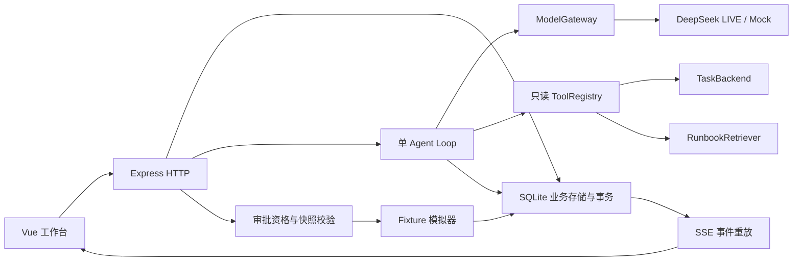

# P0 当前架构

2026-10-01，P0与M5本地实现版本。M1/M2 文档保留各阶段历史，本文件描述当前代码。

2026-10-03 M6.1 增量：独立 `/local`、`/local/projects/:projectId` 页面及 `/api/v1/local-*` API 使用 `local_project`、不可变 `local_revision`、`local_execution`、日志与产物表（schema v5）。固定 SQL 运行器由 Node 子进程启动，在内存 SQLite 上实际查询合成订单；父进程依据独立 3/100 断言判定业务结果。幂等请求、全局单执行、超时、取消和重启中断与现有 FIXTURE 模拟器分开。runner 文件随服务端 build 复制到 dist。M6.1 阶段不接 Agent 或审批；下方原架构图仅描述 P0/M5 诊断闭环。

2026-10-05 M6.2 增量：schema v6 独立增加 `local_repair_session`、`local_repair_tool`、`local_repair_evidence`，不复用外键指向 `task_run` 的旧 `diagnosis_session`/`approval_request`。本地 Agent 会话绑定 project、execution、revision/hash；三个只读工具仅查询该版本 SQL、执行状态和已保存日志，证据保存来源及版本。模型返回完整新 `task.sql`，服务端校验路径、大小、基准哈希与证据，计算 Diff。页面审批绑定候选哈希、固定 `orders-sql-v1` 验证命令和有效期；事务新增版本后触发一次 M6.1 真实执行。若提交后启动失败，记录 `APPLY_FAILED` 与新版本，重启不自动重放。审批后的验证结果由实际执行及独立 3/100 断言决定。M6.3 自动循环仍未实现。

旧 FIXTURE Agent 与本地修复 Agent 共用进程内 LIVE 请求计数器，有限请求配置不会在两个入口分别重新计数；进程重启仍会重置，尚无跨进程/持久配额。

M5新增 `/diagnoses` 历史页与 `/demo` 场景页。历史通过只读分页查询连接会话、任务、最后轮次和该轮结果，不拉取完整消息或轨迹；摘要不能借用更早轮次。工作台的 session query 可指定历史会话，加载快照前校验 run_id，不匹配时不显示对话、不提供发送入口。原有会话API和SSE保持兼容，无数据库迁移。

运行创建时间范围经共享schema检查ISO8601和顺序，归一到UTC后用参数化SQL包含边界查询。前端保持URL状态、AbortController与请求序号，日志窗口最多200条；浏览历史暂停跟随，支持前后翻页与回到最新。工具轨迹折叠时不挂载卡片，展开每页最多20条；快照仍保留本会话的全部200条合成工具记录，未宣称服务端快照无限规模可用。

## 层与事实来源

| 层 | 入口 | 当前责任 |
|---|---|---|
| 页面 | apps/web/src/pages | 运行列表、日志、会话、诊断和按钮审批；模型来源与数据来源分别标识。 |
| 协议 | packages/contracts/src/index.ts | HTTP DTO、轮次/证据/审批、事件 envelope、诊断结果的 Zod 契约。 |
| HTTP | apps/server/src/http.ts | 参数校验、错误和 request_id、幂等 API、快照、SSE；消息返回 202 后启动 Agent。 |
| Agent | diagnosis-agent.ts、diagnosis-context.ts | 有界多轮上下文、工具循环、流式落库、一次格式/语义修复、超时/取消。 |
| 适配 | model-gateway.ts、diagnosis-tools.ts、tool-registry.ts | 模型与数据/检索替换点；可信代码注册，禁止模型或 HTTP 注册任意执行能力。 |
| 持久化 | db.ts、diagnosis-store.ts、store.ts、local-execution.ts、local-repair.ts、local-repair-loop.ts | SQLite schema v9；旧 FIXTURE 表不重建，本地执行、修复会话和有限循环使用独立表。当前用例直接使用 SQLite，不宣称有完整通用 Repository 层。 |

SQLite 是事实来源；前端流式文本只是预览，结构化结果必须经服务端校验。事件 seq 按会话递增，快照事务读取 last_event_seq，随后订阅 after_seq。前端以 session_id、seq 去重，以 generation、AbortController 和 evidenceTicket 阻止旧请求覆盖新会话。重试失败的模型流使用 message.reset 清除该次未验证片段。

## Agent 与权限

默认四个只读工具：get_task_run、get_task_definition、get_task_logs、search_runbook。运行状态由服务端预读；其余查询由模型选择。工具限制绑定 run/task、严格参数与 20KB 返回体。Runbook 是七篇自建文档的关键词检索，最多返回三段；M5新增缺字段、SQL列错误和重复订单手册，不是向量 RAG。

当前 Prompt m5-4。模型使用 JSON Output，但仍执行 Zod 和语义校验：NONE 仅允许成功运行；成功运行须有非空、带引用且SUPPORTED的NONE结论；UNKNOWN 必须 NEEDS_CONFIRMATION，不能与已知类别混杂，更深原因未确定时放在missing_information；已知失败原因至少引用已注册 LOG；所有引用属于当前会话，重试建议必须绑定当前合资格运行。修复格式时同时提醒证据与语义规则，仍只允许一次文本修复。LOG 类型门槛不自动证明模型解释正确，内容准确性仍由独立评测检查。上下文明确fixture原运行不可修改或重分类；重试拒绝码属于策略决定，不证明未知失败的具体原因。

多轮上下文增加registered_log_evidence：仅从当前会话已经登记的LOG中选取、核对locator.run_id，按source_id去重，最多12条、每条摘录500字符，读取最多200条候选。首次诊断没有预取新任务日志；模型仍须调用get_task_logs。该引用集合在逐轮输入和输出修复提示中显式提供，历史证据仍按原ID校验，不创建或替换引用，不增加模型的执行权限。

每轮最多 12 次模型请求、8 次动态工具调用、120 秒；模型请求 45 秒，工具 5 秒；暂时性请求失败最多重试一次，输出修复最多一次。LIVE 不静默回退 Mock。本机持续 LIVE 授权与 2048 输出上限保留；有限请求计数只在进程内，不能充当跨重启费用账本。

M6.3 另有独立的本地修复循环服务：只接受当前版本的失败本地执行及显式 `{authorize:true}`，将固定 `task.sql`、`orders-sql-v1`、3 轮/36 次请求/10 分钟范围保存于循环行。每轮调用 M6.2 修复会话，只有其候选经过原证据/版本校验后才自动批准；验证实际失败的执行及日志绑定下一轮。循环汇总各轮实际模型请求和 usage；v9 增加停止请求时间，取消或超时先显示 STOPPING，实际任务收尾后写终态。重启只标记 INTERRUPTED；不从模型中断点恢复，也不借用 FIXTURE 审批。

审批由独立确定性用例执行：校验当前资格、诊断建议、10 分钟有效期、运行快照；SQLite 事务和唯一约束保证 parent 的 child 与 action_execution 不重复。聊天文字不能批准或执行。场景模拟器每 250ms 从持久化事件索引推进，重启恢复模拟进度。原失败运行不被改写。

## 恢复与可观测性

持久化 run/log、session/turn/message、tool_call、evidence/result、agent_event、approval/execution 和 simulation_state。浏览器断流恢复的是已保存事件；服务重启将活动诊断置 INTERRUPTED，并允许新 turn。**没有 Agent 的 plan、working_memory 或执行 checkpoint，不能从模型循环中断点 Continue；本阶段按用户要求暂缓。**

日志白名单保存 request/run/session/turn/tool/event ID、错误、Prompt 版本、模型请求序号、耗时和 usage；不输出 Key、完整问题/Prompt/工具正文。model.first_delta 计的是请求开始到第一个内容或工具 delta；页面提交反馈与整轮耗时分开记录。评测的实际回答仅来自独立 fixture 会话，另存评测产物。

工具成功的有界 output 保存于已有 result_summary_json，并随 tool.completed 输出；无需数据库迁移。ToolTraceCard 通用展示调用 ID、用途、开始时间、终态耗时、参数和查询结果，结果以文本渲染、不执行 HTML。旧记录/事件没有完整 output 时继续展示已有摘要；不会伪造历史完整结果。

任务与日志都是 FIXTURE，成功重试是模拟恢复。当前验证为 Windows 本地单用户、小样本、Chrome；不含生产负载、公网鉴权、真实任务连接或跨浏览器验收。
