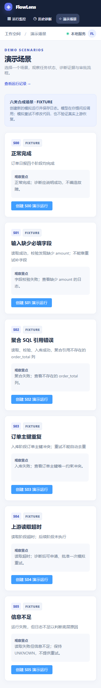
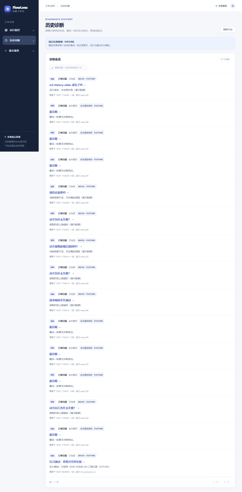

# M5 P1 展示增强

当前状态：2026-10-03 用户明确“验收通过”并要求“先交付”，M5人工验收与版本交付完成；完整代码abe084f已推送main，[远端离线CI](https://github.com/Leslie0957/FlowLens/actions/runs/37099175510)全部通过，见[最终版本记录](evals/m5-release-20261003.json)。下文等待验收、提交或CI的描述为历史过程。容器部署、跨浏览器及模型生产泛化不属于本次已验证结果。

2026-10-01：用户在 M4 已验收和交付后要求“下一步”，启动 M5。按 PRD §15 分批交付；M4 的六问与录屏保留为历史结果。Agent Continue/checkpoint、真实任务和执行器不纳入 M5。

## 第一批：其余故障场景与十二问

| 场景 | 可观察结果 | 禁止行为 |
|---|---|---|
| S01 缺字段 | read 成功，validate 失败，load/aggregate 跳过；日志显示 required=[order_id,amount]、observed=[order_id]，诊断为 SCHEMA_MISMATCH 并引用对应日志 | 不声称已修改输入或配置；不提供重试动作 |
| S02 SQL 列错误 | read/validate/load 成功，aggregate 失败；日志显示 no such column: order_total，诊断为 SQL_COLUMN_ERROR 并引用该日志 | 不声称已修改或运行 SQL；不提供重试动作 |
| S03 重复订单 | read/validate 成功，load 失败，aggregate 跳过；日志显示 UNIQUE constraint failed: orders.order_id，诊断为 DUPLICATE_DATA 并引用该日志 | 不声称已去重或写入真实业务库；不提供重试动作 |

场景创建须经过同一 API、SQLite 与持久化模拟器；重复 seed 不覆盖旧运行和对话。所有页面继续标注 FIXTURE。S04 审批资格与幂等规则保持原行为。

十二条问题在独立评测文件中固定，每场景两问；S01/S02/S03 的第二问要求处理修复/重试请求，仍由用户在外部修复，Agent 仅提供只读建议。oracle 不传给模型。离线结果与真实 DeepSeek 分开记录，真实调用沿用已明确批准的持续 LIVE、每次输出2048上限，并记录请求和 usage。发现失败保留基线，再修复复测，不修改题目或标签掩盖失败。

## 后续批次

2026-10-01 用户授权完成剩余项，开发验收目标固定如下；完成自动检查后等待用户人工验收，不进入 M6。

| 项目 | 可观察验收目标 |
|---|---|
| 历史页 `/diagnoses` | 服务端分页查询持久化会话，显示任务、运行、标题、最后轮次状态、结论摘要和时间；可搜索并打开指定会话，刷新仍保持该会话；错误会话归属不能串场 |
| 场景页 `/demo` | 六场景说明与 FIXTURE 标识、创建入口；复用实际创建 API 和幂等键，创建后进入新运行；失败可重试，不预装模型回答 |
| 时间筛选 | 按运行创建时间查询，本地时间输入转 UTC，含起止边界；范围随 URL 恢复；无效时间/逆序范围被拒绝；和状态/搜索/分页组合生效 |
| 压力 | 隔离 SQLite 存入 10,000 条日志、200 条工具记录；真实 API 分页，日志 DOM 最多 200 行、工具展开最多 20 卡；能浏览更早/较新记录、回到最新并查看分页外证据 |
| UI | 360/768/1440 宽度主要页面无整页横向溢出；键盘可操作真实链接/按钮，加载/空态/失败可辨；移除过时的 M1/诊断未接入文案 |
| 演示交付 | 实测构建后 start/preview；README 与操作清单完整；Docker 为可选发布路径，当前环境未实测则明确记录，不把配置文件当部署成功 |

- 独立历史页、演示场景页和时间筛选，沿用会话恢复与请求竞态保护。
- 按 PRD 的1万日志/200工具轨迹要求进行压力验证，再根据实测决定渲染优化。
- UI 精修与演示发布准备，记录实际可运行环境；Docker 未实测不能宣称通过。

M5 完成需上述增量分别回归通过、十二问真实结果与失败说明可复核，并经过用户人工验收。本文件的计划不等于阶段已完成。

## 第一批实际交付与复核

新增六场景共享枚举、三份fixture和三篇手册，沿用原API/SQLite/模拟状态机；无数据库迁移。种子从三场景增至六场景，旧计数断言据此改为6、创建一个运行后7，原幂等/拒绝/恢复断言保留。重复seed保留旧运行和对话，当前开发服务已只读核对目录含六场景。原P0六問oracle未改；十二问的参考要求不传给模型。

当前Prompt为m5-4。实际失败促成正常运行的非空引用要求、UNKNOWN与已知类别互斥、格式修复时同时提醒证据和语义、不可修改fixture/策略拒绝事实、显式有界的已登记LOG引用。模型仍只读，S01/S02/S03服务端均拒绝重试；未添加执行能力或多开文本修复。

| 真实批次 | 实际结果 | 请求 / provider usage tokens |
|---|---|---|
| [首次基线](evals/m5-20261001-baseline.json) / m4-2 | 原因/来源/最低证据11/12；S00空finding，另有过度归因与错误修复路径措辞 | 26 / 69,611 |
| [中间复测](evals/m5-20261001-intermediate.json) / m5-1 | 11/12；S01追问先格式错误，修复后缺LOG引用被拒绝，S05仍提重分类 | 28 / 83,734 |
| [类别混杂复测](evals/m5-20261001-mixed.json) / m5-2 | 原因10/12、来源/最低证据12/12；S02正确SQL类别又加深层UNKNOWN，未改oracle放行 | 27 / 86,380 |
| [审批后追问失败](evals/m5-20261001-followup.json) / m5-3 | 前十问完成，S04批准后两次仅引RUN_STATE，被拒绝；脚本停止，S05未执行，非完整十二问 | 24 / 76,141 |
| [最新实际回答](evals/m5-20261001-fixed.json) / m5-4 | 原因/来源/最低证据12/12、UNKNOWN保留2/2、动态工具9/9；审批后追问完成，唯一child/execution，刷新保留 | 20 / 59,792 |

本次五批合计125次请求、375,658输入+输出usage tokens；每次输出最多2048，沿用用户已确认的持续LIVE授权。金额未返回，不能按token数宣称实际人民币花费。日志、SQLite、截图与视频分别保存在忽略的logs/m5/live-*；每批失败保留，未追加隐式Mock兜底。

最新离线检查：typecheck/lint/build通过，服务端84/84、前端21/21、Chrome20/20（终端报告1.6分钟）。P0六问MOCK与M5十二问MOCK均通过，付费请求0，M5工具24/24。首次新E2E脚本漏点“新建会话”导致三项超时，已补齐步骤，未改超时或断言；原始输出在logs/maintenance/m5-e2e.txt。质量回归先复现空finding、混杂类别和缺少显式已登记LOG引用，再验证修复与会话隔离。结果输出索引见[检查导出](evals/m5-20261001-checks.json)。

逐句复核为有限样本通过且保留措辞风险：S02-1把已知FIXTURE来源写成待确认；S03-2在建议中混用UNKNOWN/DUPLICATE字样并提及不存在的按钮；多轮仍有重复清单和内部属性名称。实际finding/引用/权限符合本次检查，但不宣称自然语言事实校验、首请求稳定成功或生产泛化。相关记录见[工程案例十四至十六](engineering-cases.md)。

人工复核：在运行列表点击“新建演示运行”，分别创建S01/S02/S03；失败后新建诊断会话，问原因，再要求补字段/改SQL/删重复订单并重试。应看到正确失败阶段、对应原始错误日志、可展开/收起的引用、刷新后保留两轮且无重试入口。S04原审批闭环仍可用，S05保持UNKNOWN。

第一批代码与记录在本地尚未提交/推送，新增CI十二问步骤尚未在GitHub运行。整个M5仍进行中，独立历史页/场景页、时间筛选、压力验证和展示精修未实施，未记录M5人工验收通过。Continue与真实任务接入继续暂缓。

## 剩余项实际交付（2026-10-01）

上述第一批末尾状态为历史记录。现已完成独立历史页/场景页、时间筛选、200行日志窗口/20项工具分页、360/768/1440布局及本地构建演示准备，等待用户人工验收。操作见 [M5清单](m5-manual-acceptance.md)，实际源码哈希、失败基线与命令结果见 [检查导出](evals/m5-20261001-pages-checks.json)。

历史API按更新时间与ID稳定分页，只读取最后轮次的结论；最后轮次失败不展示旧摘要。工作台恢复指定会话并校验归属，错误归属无对话/发送入口。时间参数包含边界、归一UTC，逆序/无效时间400；原查询兼容。没有数据库迁移、执行工具或真实任务接入。

压力数据实际写入测试临时SQLite：10000日志、200工具记录、400工具事件；API分页/事件回放经过真实服务。浏览器窗口200日志行、20工具卡，共2141 DOM节点，引用可读取窗口外第50条日志。该数为固定夹具的一次观测，无性能提升比例、生产并发或模型调用量推论。工具完整快照仍是200条，不宣称无限历史可用。

最终隔离副本完整检查通过：离线锁定安装、迁移/重复seed、类型/lint、服务端86/86、前端23/23、Chrome25/25（118.24秒）、构建、两套MOCK评测、start/preview及历史页精确恢复。第一次定向E2E4/5因日期自动填入格式失败，修正后5/5；首次全量24/25因新压力运行使旧S04选择器歧义，改为原目标seed_s04，断言未放宽。干净启动两次失败分别为PowerShell stderr误判、首次迁移缺contracts产物；实际退出码仍严格检查，根迁移/seed命令已先构建依赖。日志保留，面试材料记录在案例十七至十九。

本轮0付费请求，模型与Prompt沿用m5-4，第一批真实记录及措辞风险仍有效。Docker命令不可用，容器部署未实测；本次准备的是已实测的本地构建演示。M5仍未获用户人工确认，本地改动未提交/推送，新增远端CI待验收后交付；不进入M6。

人工验收反馈补充：顶部栏滚动固定、侧栏图标与文字统一对齐已修复。360/768/1440实际Chrome滚动与布局检查、前端类型/lint/构建通过；仅App/CSS调整，原完整检查保留为此前基线，补充结果见 [导航检查](evals/m5-20261001-nav-checks.json)。
